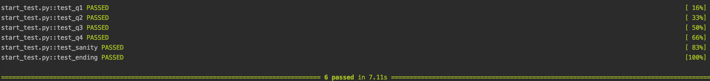

# Apache-Spark-Practice

This is a practice problem set of Apache Spark.


### 1 Set Up the Environment

Before you start, you need to have,

* `Python 3.8+`
* `PySpark 3.2.0+`
* A Python IDE (e.g. `Pycharm` is recommended)

Then, clone this repository somewhere,

```bash
$ git clone https://github.com/Sadamingh/Apache-Spark-Practice.git
```

<br>

### 2 What to Do?

For each problem, what you have to do is to,

* Implement the `start.py` script by following the instructions in that script
* Make sure you followed the PEP8 pattern (or you won't pass the sanity test)

You can test the result by,

```bash
$ pytest -v start_test.py
```

A successful result should be something like,



For the solutions, you can refer to the `solution.py` file in each problem folder.

<br>